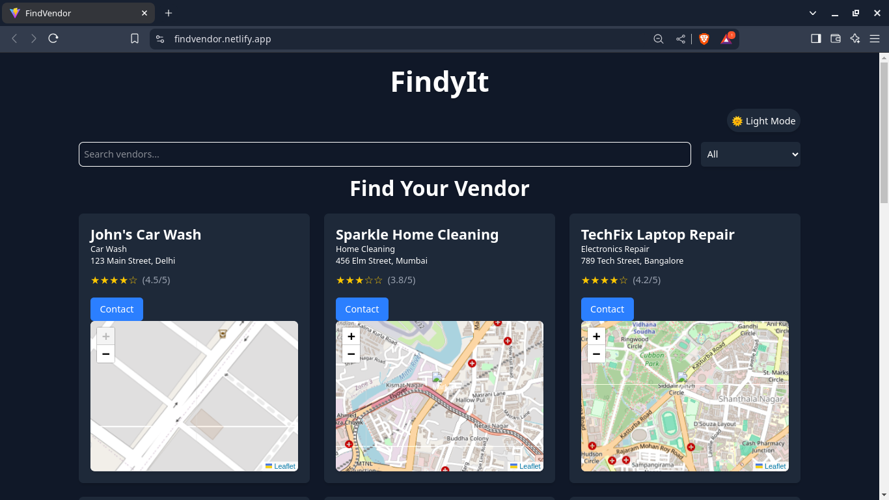

# FindVendor

FindVendor is a web application that helps users locate vendors in different categories, such as car washes, home cleaning services, and more. The app features a search bar, category filter, interactive map, and a dark mode toggle for better user experience.

## Live Demo
[FindVendor Live](https://findvendor.netlify.app/)

## Features
- 🔍 **Search Vendors** by name or category
- 📍 **Interactive Map** to show vendor locations
- 🌙 **Dark Mode Toggle** for a comfortable viewing experience
- ⭐ **Ratings Display** with stars and numeric values
- 📞 **Contact Button** (currently showing a dummy message)

## Screenshot



## Tech Stack
- **Frontend:** React, Tailwind CSS
- **Map Integration:** Leaflet.js
- **Deployment:** Netlify

## Installation

To run this project locally, follow these steps:

1. **Clone the repository:**
   ```sh
   git clone https://github.com/IRFAN-KHAN-git/FindVendor.git
   cd FindVendor
   ```
2. **Install dependencies:**
   ```sh
   npm install
   ```
3. **Start the development server:**
   ```sh
   npm run dev
   ```


